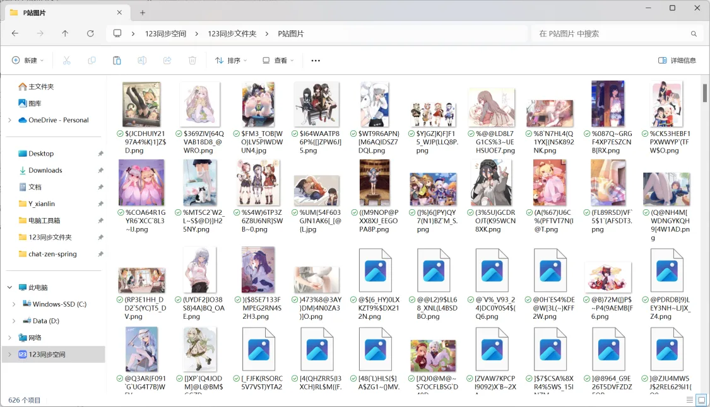
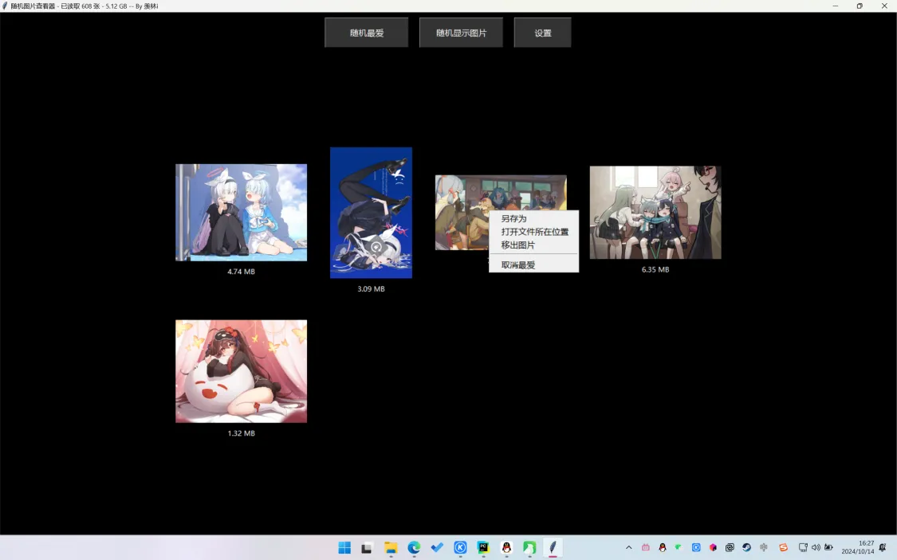

## 基础前言
由于存储的图片越来越多, 用图时找图也不方便

因为每张都是自己觉得好才存的

所以随机出来的基本也都满意

## 程序设计
1. 使用Python设计程序, 需要写好详细中文注释
    1. 程序只适配Windows, 不兼容Linux和Mac
    2. 程序窗体为宽1200高800 字体为微软雅黑, 背景为黑色
    3. 程序启动时默认窗口全屏
    4. 程序会读取指定目录下的全部文件, 不读取文件夹, 获取全部文件的大小, 目录下默认全是图片文件
2. 读取完成后, 展现出图形化界面, 标题显示文件数量和总大小
    1. 程序启动时标题默认为 随机图片查看器
    2. 读取完毕后标题更新为 随机图片查看器-已读取**张-**GB
3. 程序提供一个随机按钮, 点击后随机展现8张图片, 展现图片4*2横纵排列, 图片展示居中
    1. 每张图片下面显示文件大小,单位为MB
    2. 已经展示过的图片就不再展示
    3. 左键点击展现的图片后会直接打开
4. 添加随机最爱, 随机显示配置文件中的图片
    1. 同3
5. 右键点击图片会出现菜单
    1. 另存为:将所选图片另存为至指定目录, 默认文件名为 另存图片-分秒
    2. 打开文件所在位置: 打开所选图片所在位置并选中
    3. 移出图片:会将图片移动到"Remove"子目录
    4. 随机最爱:将所选文件保存到配置文件中
        1. 配置文件在目标文件夹根目录下, 不使用默认配置文件, 避免冲突
    5. 取消最爱:将文件从配置文件中移除
6. 程序提供一个设置按钮
    1. 点击后, 可以配置默认读取目录和默认保存目录
    2. 配置后在程序目录生成配置文件, 如果有配置文件则执行默认操作
    3. 可以重置路径, 默认为空
    4. 输入输出路径都是选填, 不用两个都填
7. 要求界面设计简洁漂亮, 样式为高对比度

## 程序实现

### V1.3 更新移出图片/最爱图片

[点击获取V1.3发行版](https://github.com/xianlin520/ImgRandomDisplay/releases/tag/V1.3)

[随机图片查看器.exe](https://www.yuque.com/attachments/yuque/0/2024/zip/28117057/1728894370670-01d79269-f612-463a-b0ac-290de9d9cf03.zip)

[随机展示图片v1.3.py](https://www.yuque.com/attachments/yuque/0/2024/py/28117057/1728894380466-aea4b8f8-87ff-438f-bacb-29c4c3d5123c.py)

版本描述:  
v1.0

1. 窗口化全屏（最大化窗口）
2. 选择图片目录
3. 随机显示图片
4. 显示图片的大小
5. 保存到指定目录

v1.1

6. 保存配置文件, 自动读取配置文件
7. 默认使用配置的输入输出路径目录

v1.2

8. 在右键菜单上添加“打开文件所在位置”选项
9. 在右键菜单上添加"移出图片"功能, 会将图片移动到"Remove"目录

v1.3

10. 在右键菜单上添加"设为最爱"功能, 将文件保存到配置文件中  
配置文件在目标文件夹根目录下, 不使用默认配置文件, 避免冲突
11. 添加随机最爱功能, 随机显示配置文件中的图片
12. 在右键菜单上添加"取消最爱"功能, 将文件从配置文件中移除

